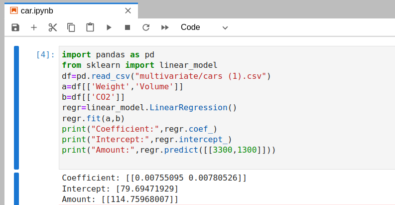

# Implementation of Multivariate Linear Regression
## Aim
To write a python program to implement multivariate linear regression and predict the output.
## Equipment’s required:
1.	Hardware – PCs
2.	Anaconda – Python 3.7 Installation / Moodle-Code Runner
## Algorithm:
### Step1
Import panda module as pd.
<br>

### Step2
Import linear model from sklearn.
<br>

### Step3
Read the file cars.csv.
<br>

### Step4
Assign the values for x and y as required.
<br>

### Step5
Create the linearRegression model and predict the output.
<br>

## Program:
```
'''
Developed by: Sneha Basyal M
Register number: 212222240101
'''
import pandas as pd
from sklearn import linear_model
df=pd.read_csv("multivariate/cars (1).csv")
a=df[['Weight','Volume']]
b=df[['CO2']]
regr=linear_model.LinearRegression()
regr.fit(a,b)
print("Coefficient:",regr.coef_)
print("Intercept:",regr.intercept_)
print("Amount:",regr.predict([[3300,1300]]))
```

## Output:

<br>

## Result
Thus the multivariate linear regression is implemented and predicted the output using python program.